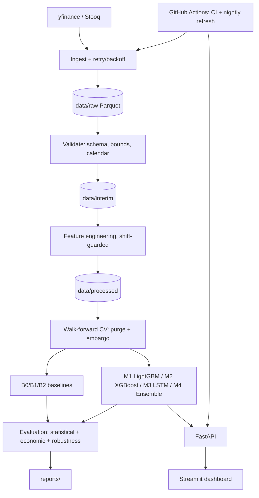

# AlphaBench

A walk-forward equity return forecasting and backtesting platform.

> **Disclaimer.** AlphaBench is an academic research and software-engineering artifact.
> It is **not investment advice**, not a trading product, and must not be used to make
> financial decisions. All results are historical simulations and carry no guarantee of
> future performance. This disclaimer is repeated in every API response and rendered
> before anything else on the dashboard.

## What this is

AlphaBench asks one narrow, honestly-measurable question: **given a universe of liquid
equities and their daily OHLCV history, can a supervised model predict the *sign* of the
next *h*-day return with accuracy statistically distinguishable from chance, and does
that edge survive realistic transaction costs?**

It deliberately does *not* attempt to predict price levels — the naive formulation nearly
every "stock prediction LSTM" project uses, which trivially "succeeds" by learning that
tomorrow's price looks like today's. That result has zero economic content. AlphaBench
instead predicts direction, on a volatility-scaled deadband, validated with expanding-
window walk-forward cross-validation (purge + embargo), backtested net of costs against
buy-and-hold, and reported with bootstrap confidence intervals throughout. See
`PROPOSAL.md` for the full methodology and rationale.

## Headline result — read this first

**The primary market (NSE, 30 large-cap Indian equities, h=1 day) is a null result, and
this is reported as such.**

| Metric | Value |
|---|---|
| Walk-forward ROC-AUC (mean across 7 folds, 2017-2023) | 0.506 (M1 LightGBM); 0.49-0.52 across the *entire* model ladder |
| Backtest Sharpe, net of 10 bps costs | 0.108 |
| Buy-and-hold NIFTY Sharpe, same window | 1.80 |
| Excess Sharpe (strategy − benchmark) | −1.69 |
| Bootstrap 95% CI on strategy Sharpe | [−0.45, 1.13], p(Sharpe > 0) = 0.70 |
| Strategy Sharpe at 20 bps costs | −0.13 (negative) |
| Deflated Sharpe probability (50 Optuna trials) | 0.46 — not significant at 95%; the null bar alone (0.146 annualised) exceeds the observed 0.108 |

Every model tried — a naive persistence baseline, logistic regression, ARIMA, LightGBM,
XGBoost, an LSTM, and a rank-average ensemble of the last three — lands in a tight
0.49-0.52 AUC band, each with a fold-to-fold standard deviation of roughly 0.01-0.02.
That means **the differences between models are not distinguishable from noise at this
sample size**, and none of them clears a bar that would survive costs. The strategy
underperforms simply buying and holding the NIFTY 50 over the same period.

This is the expected outcome for a rigorous treatment of this problem (see PROPOSAL.md
sections 1 and 8.1) — daily equity returns are close to a martingale difference sequence,
and a ceiling of roughly 53-55% directional accuracy is the realistic best case for *any*
approach at this data scale. A well-documented null result is treated as a successful
outcome here, not a failure to hide.

**The Week 9 generalisation test (identical pipeline, US large-caps, benchmark SPY)
confirms the same finding on an independent market:**

| Metric | NSE (primary) | US (generalisation) |
|---|---|---|
| Walk-forward ROC-AUC, M1 LightGBM h=1 | 0.506 ± 0.011 | 0.519 ± 0.028 |
| Backtest Sharpe, net of 10 bps | 0.108 | 0.349 |
| Buy-and-hold Sharpe, same window | 1.80 (NIFTY) | 1.05 (SPY) |
| Excess Sharpe | −1.69 | −0.70 |
| Bootstrap 95% CI, p(Sharpe > 0) | [−0.45, 1.13], 0.70 | [−0.22, 1.30], 0.88 |

No hyperparameters were retuned for the US run — same `DEFAULT_PARAMS` as NSE, only the
universe/benchmark changed. The strategy beats a coin flip by a small, noisy margin in
both markets and underperforms simply buying and holding in both. That consistency across
two independent markets is itself the finding: this isn't a market-specific fluke, it's
what you get from this feature set and this data scale in general.

**The sealed holdout (2025-01-01 onward, touched exactly once) confirms it:** ROC-AUC
**0.5047**, bootstrap 95% CI **[0.4817, 0.5266]** — straddling 0.50, indistinguishable
from chance. Net of 10 bps costs, the holdout-period backtest loses money in absolute
terms (Sharpe −0.58, ann. return −1.3%) while buy-and-hold NIFTY rises 10.2% over the same
276 trading days (Sharpe 0.73, excess Sharpe −1.31). This is the single most important
number in the project, and it agrees with every walk-forward fold, both markets, and the
entire model ladder above.

## Reproduce from a clean clone

```bash
git clone https://github.com/veerendrakosuri/AlphaBench.git
cd AlphaBench
make setup && make all
```

`make all` runs ingest → validate → build-features → train (LightGBM h=1) → backtest, and
reproduces the headline numbers above from the committed `data/processed/*.parquet` (no
network access required — see "Why processed data is committed" below). To reproduce the
full model ladder:

```bash
make train-lightgbm  # or: python -m alphabench.cli train --model lightgbm --horizon 1
python -m alphabench.cli train --model xgboost --horizon 1
python -m alphabench.cli train --model arima --horizon 1
python -m alphabench.cli train --model lstm --horizon 1
python -m alphabench.cli compare-models --horizon 1
```

`make test` runs the full suite (53 tests, including the leakage and splitter tests that
are the project's actual core); `make lint` runs ruff + mypy.

## Architecture

```
alphabench/
├── config/                     master config, US/NSE universes, per-market config files
├── docker/                     api.Dockerfile, dashboard.Dockerfile
├── .github/workflows/          ci.yaml, refresh-data.yaml, keep-alive.yaml
├── data/
│   ├── raw*/, interim*/        NEVER committed (gitignored) — provider cache, per market
│   └── processed*/             features/targets/OOF predictions — committed (see below)
├── models/                     per-model artifacts + metadata.json (features, params,
│                                train dates, CV AUC) — committed
├── reports/
│   ├── figures/                equity curves, SHAP plots, ACF/PACF
│   └── metrics/                every walk-forward/backtest/holdout result as JSON
├── src/alphabench/
│   ├── cli.py                  Typer app — the single entrypoint for every stage
│   ├── config.py                pydantic config loader
│   ├── data/                   providers (yfinance + Stooq failover), ingest, validate,
│   │                            repository (the only module that touches disk)
│   ├── features/               ~60 shift()-guarded features: momentum, volatility,
│   │                            technical, volume, cross-sectional, market/calendar
│   ├── targets/                forward returns + volatility-scaled deadband labels
│   ├── validation/             WalkForwardSplit (purge + embargo), leakage assertions
│   ├── models/                 baselines (B0/B1), arima (B2), lstm (M3), ensemble (M4)
│   ├── training/                walk-forward training loops per model + Optuna tuning
│   ├── evaluation/              backtest engine, robustness (bootstrap, deflated Sharpe,
│   │                            DM test, per-year/per-ticker), SHAP interpretability
│   ├── api/                     FastAPI service (/health, /predict, /backtest, /metrics)
│   └── dashboard/                Streamlit dashboard (signal, backtest, validation tabs)
└── tests/                       53 tests; test_leakage.py and test_splitters-equivalent
                                  coverage are the most important files in the repo
```



**Why processed data is committed.** `data/processed/*.parquet` (features, targets, OOF
predictions) is tracked in git, unlike `data/raw*/` and `data/interim*/` which are always
ignored. This is deliberate: the project's own architecture is cache-first — "every
downstream stage reads Parquet, never the network" — and that includes the deployed API,
which never depends on live yfinance availability at build or run time. Raw provider data
is never committed, both for repo hygiene and because `yfinance` scrapes undocumented
endpoints and shouldn't be redistributed.

## The model ladder (B0 first — a number without its baseline is not a result)

NSE, h=1, mean across 7 walk-forward folds (2017-2023):

| Model | ROC-AUC | Accuracy | Base rate |
|---|---|---|---|
| B0 persistence | 0.487 | 0.488 | 0.518 |
| B0 majority | 0.500 | 0.518 | 0.518 |
| B1 logistic regression (5 features) | 0.510 | 0.518 | 0.518 |
| B2 ARIMA(1,0,1) on log returns | 0.503 | 0.511 | 0.518 |
| **M1 LightGBM (primary)** | 0.506 | 0.518 | 0.518 |
| M2 XGBoost | 0.515 | 0.518 | 0.518 |
| M3 LSTM (PyTorch, CPU, small) | 0.515 | 0.518 | 0.518 |
| M4 rank-average ensemble (M1+M2+M3) | 0.514 | 0.508 | 0.518 |

ADF and KPSS tests agree that all 29 symbols' daily log-return series are stationary
(29/29 by both tests), justifying the ARIMA order used; the ACF/PACF of a representative
symbol shows near-white-noise autocorrelation beyond lag 0 — see
`reports/figures/arima_acf_pacf.png`. **Prophet was rejected** rather than included in the
ladder: Prophet decomposes a series into trend + seasonality + holiday components, which
presumes structure daily equity returns simply don't have — applying it here would fit
smooth curves to noise rather than model anything real, and demonstrating that intuition
with a run would only have spent compute confirming the obvious.

## Survivorship-bias disclosure

The universe is today's 30 constituents, backfilled to 2010. Companies that were
delisted, acquired, or went bankrupt over that window are absent from the sample, which
biases realised returns upward — this bias is **not eliminated, only disclosed and
bounded**. Because the target here is relative *direction* rather than absolute return
level, the impact on directional accuracy is materially smaller than it would be on a
long-only return backtest, but it is not zero: any symbol whose long-run drift was
survivorship-conditioned still contributes to the label distribution the model is trained
on. Point-in-time constituent data is not available for free, so this limitation is
inherited rather than fixed. See PROPOSAL.md section 5.4.

## Deployment

- API: FastAPI + Uvicorn, containerised via `docker/api.Dockerfile`, deployed to
  [Render](https://render.com)'s free tier. **Render's free web services sleep after
  ~15 minutes idle; the first request after a sleep takes 30-60 seconds to wake the
  container.** A GitHub Actions workflow (`keep-alive.yaml`) pings `/health` every 10
  minutes during typical waking hours to blunt this for anyone reviewing the project live.
- Dashboard: Streamlit, containerised via `docker/dashboard.Dockerfile`, deployed to a
  Hugging Face Docker Space. `API_URL` is set as a Space variable pointing at the Render
  deployment; the disclaimer renders before any other content on load.

**Live URLs:** _pending — added once deployed (see project status below)._

## Project status

This README reflects an in-progress capstone. See `BUILD_PLAN.md`'s "Final checklist
before you call it done" for the authoritative list of what's complete.

## License

MIT — see `LICENSE`.
