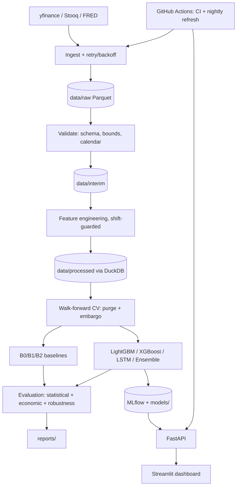

# AlphaBench

## A Walk-Forward Equity Return Forecasting & Backtesting Platform

**Project Proposal**

| Field | Value |
|---|---|
| Document version | 1.0 |
| Date | August 2026 |
| Author | *[Your name]* |
| Programme | B.S. Mathematics & Computing Sciences, Year 4 |
| Project type | Individual / small-team capstone (solo-buildable) |
| Duration | 10 weeks |
| Deliverable | Reproducible research codebase + REST API + interactive dashboard + technical report |

> **Disclaimer.** AlphaBench is an academic research and software-engineering artifact. It is not investment advice, not a trading product, and must not be used to make financial decisions. All results are historical simulations and carry no guarantee of future performance.

---

## 1. Executive Summary

Most student "stock price prediction" projects train an LSTM on raw closing prices, plot the prediction against the actual price, observe a near-perfect overlay, and report an R² of 0.98. That result is an artifact, not a finding: the network has learned the identity function on a highly autocorrelated series, and the "prediction" is simply yesterday's price shifted one day right. It has zero economic content and any competent reviewer will identify it in under a minute.

AlphaBench is designed to be the opposite of that project. It reframes the task from **price level prediction** (trivially and misleadingly easy) to **short-horizon return direction prediction** (genuinely hard, honestly measurable), and wraps it in the experimental machinery that makes the result trustworthy: leakage-audited feature construction, walk-forward cross-validation with purging and embargo, a cost-aware backtest engine, and statistical significance testing against naive baselines.

The headline claim of this project is not "I predicted the stock market." It is: **"I built a rigorous, reproducible, deployed research platform, and I can tell you precisely how much signal exists and how confident I am in that number."** That is the claim that survives an interview.

---

## 2. Problem Statement

### 2.1 Background

Daily equity returns are close to a martingale difference sequence. The efficient market hypothesis in its weak form asserts that past prices contain no exploitable information about future prices. Empirically the truth is subtler: small, unstable, regime-dependent predictability has been documented in the literature (short-horizon reversal, momentum, volatility clustering, volume-price interactions), but the effect sizes are tiny and frequently disappear once realistic transaction costs are applied.

This creates a signal-to-noise regime unlike almost any other applied ML domain. In image classification, a model that achieves 55% accuracy is broken. In next-day equity direction prediction, a model that *robustly* achieves 55% accuracy out-of-sample, net of costs, would be a meaningful result. The entire methodology must be redesigned around that fact.

### 2.2 Problem statement

> Given a universe of liquid publicly traded equities and their historical daily OHLCV (open, high, low, close, volume) history, can a supervised learning system predict the **sign of the forward *h*-day return** with accuracy statistically distinguishable from chance, and does that predictive edge survive realistic transaction costs in a walk-forward backtest?

### 2.3 Objectives

**Primary objective (research)**
Quantify, with honest uncertainty bounds, the out-of-sample directional predictability of daily equity returns from price-and-volume-derived features across a multi-ticker universe.

**Secondary objective (engineering)**
Deliver a production-shaped, fully reproducible ML system spanning ingestion → feature engineering → walk-forward training → evaluation → backtesting → API → dashboard → containerised deployment, with CI and automated data refresh.

**Explicit non-objectives**
- This is not a live trading system. No broker integration, no order execution, no real capital.
- No intraday, tick, or order-book data (cost and infrastructure out of scope).
- No claim of profitability. A well-documented null result is an acceptable and successful outcome.

### 2.4 Success criteria

The project is judged on evidential rigour, not on the sign of the result.

| # | Criterion | Threshold |
|---|---|---|
| SC-1 | Full pipeline reproducible from clean clone by a single command | Pass/fail |
| SC-2 | Zero look-ahead leakage, demonstrated by an automated test suite | Pass/fail |
| SC-3 | Model evaluated on an untouched final holdout period | Pass/fail |
| SC-4 | ROC-AUC on holdout reported with bootstrap 95% CI | Reported |
| SC-5 | Backtest reported net of costs against buy-and-hold benchmark | Reported |
| SC-6 | API and dashboard live at public URLs | Pass/fail |
| SC-7 | Technical report states the result honestly, including if null | Pass/fail |

**Stretch criterion (not required to pass):** holdout ROC-AUC ≥ 0.53 with a bootstrap CI whose lower bound exceeds 0.50.

---

## 3. Scope

### 3.1 In scope

**Universe.** 30 tickers, not one. Single-ticker projects have two fatal weaknesses: roughly 3,800 training rows (far too few for reliable low-SNR learning) and a result indistinguishable from luck on that one name. A 30-ticker panel yields ~114,000 rows, permits cross-sectional features, and allows the central question "does this generalise across names?" to actually be answered.

- **Default market: US equities.** Rationale: cleanest free data, deepest liquidity, longest continuous history, most comparable literature. Universe = 30 large-cap S&P 500 constituents spread across GICS sectors (avoid picking 30 tech names — sector concentration will silently become the dominant factor in your results).
- **Alternative market: India (NSE).** Fully supported by the same codebase via Yahoo `.NS` suffixed symbols (e.g. `RELIANCE.NS`, `TCS.NS`, `HDFCBANK.NS`), benchmarked against `^NSEI` (NIFTY 50). Choosing NSE is a legitimate differentiator — there is far less published student work on it — at the cost of shorter reliable history for some names and thinner corporate-action data quality.

Pick one as primary in Week 1 and keep the other as a generalisation test in Week 9. Running the identical pipeline on a second, independent market is one of the strongest robustness claims available to you.

**Frequency.** Daily bars (end-of-day). Adjusted for splits and dividends.

**Historical window.** 2010-01-01 to present (~15 years). Rationale for starting at 2010 rather than 1990: it deliberately excludes the 2008 crisis. Including a once-in-a-generation dislocation in the training window teaches the model a regime it will likely never see again and inflates apparent performance through a single unrepeatable event. The window still contains meaningful regime variety: the 2015 and 2018 corrections, the 2020 COVID crash and recovery, the 2022 rate-driven drawdown, and multiple calm bull phases.

**Prediction horizons.** *h* = 1 day (primary) and *h* = 5 days (secondary). The 5-day horizon is included because signal-to-noise typically improves modestly with horizon while transaction costs amortise over a longer holding period.

### 3.2 Out of scope

Intraday/tick data; options and derivatives; news, filings, and NLP sentiment features (deliberately deferred — see §9 as an extension, since scope creep into NLP is the most common cause of unfinished capstones); live order execution; portfolio optimisation beyond equal-weighting; alternative data (satellite, card spend, etc.); reinforcement learning agents.

### 3.3 Assumptions

- Free-tier daily OHLCV data of adequate quality is obtainable (validated in Week 1; fallback providers identified in §5).
- Frictions modelled as 5 bps commission + 5 bps slippage per side, applied to turnover.
- No leverage, no shorting constraints beyond a flag, no market-impact modelling (position sizes assumed negligible relative to volume).

---

## 4. Proposed Approach

### 4.1 Reframing the target — the single most important design decision

The naive formulation is:

```
predict:  Close[t+1]        given  Close[t], Close[t-1], ...
```

This is broken for three compounding reasons:

1. **The series is non-stationary.** Mean and variance drift over time; a model fitted on $50 prices will not transfer to $300 prices.
2. **Autocorrelation makes the metric meaningless.** Because `Close[t+1] ≈ Close[t]`, the trivial persistence forecast already achieves very low RMSE and very high R². Any RMSE or R² reported on price levels is uninterpretable without that baseline, and beating it is far harder than the raw number suggests.
3. **It answers the wrong question.** No decision depends on the price level. Decisions depend on the *change*.

AlphaBench therefore predicts returns, and primarily their sign:

$$r_{t+h} = \log\left(\frac{C_{t+h}}{C_t}\right)$$

**Primary target — direction with a volatility-scaled deadband.** Classifying every day as up-or-down forces the model to take a position on days that are pure noise. Instead, define a threshold proportional to the stock's own recent volatility $\sigma_t$ (a 20-day realised volatility, computed strictly from data up to *t*):

$$y_{t} = \begin{cases} 1 & r_{t+h} > +\kappa\sigma_t \\ 0 & r_{t+h} < -\kappa\sigma_t \\ \text{excluded} & \text{otherwise} \end{cases}$$

with $\kappa \approx 0.3$ tuned on validation folds only. Training on the excluded-middle rows removed lets the model concentrate on days with actual directional content. At inference time the model emits a probability, and a trading rule fires only when that probability leaves a confidence band around 0.5.

**Secondary target — the raw return** $r_{t+h}$, for a regression head. Evaluated against a naive zero-forecast, since predicting "no change" is the correct null model for returns.

### 4.2 Model selection and justification

Four candidate families were considered against the constraints of this problem: ~114k rows, ~60 engineered tabular features, extremely low signal-to-noise, non-stationary generating process, no GPU budget, and a requirement for dozens of walk-forward refits.

| Model | Verdict | Reasoning |
|---|---|---|
| **LightGBM (gradient-boosted trees)** | **PRIMARY** | Best-in-class on tabular data at this scale. Trains a full model in seconds on CPU, which is what makes 10+ walk-forward folds × hyperparameter search computationally feasible at all — the single biggest practical constraint. Handles missing values natively, supports monotonic constraints to encode priors, and yields SHAP attributions for interpretability. Regularises well in low-SNR settings. |
| **XGBoost** | Secondary / ensemble | Near-equivalent performance, different regularisation and split-finding behaviour. Included as a diversification arm; probability rank-averaging with LightGBM typically yields a small, cheap stability gain. |
| **LSTM / GRU (PyTorch)** | Comparison arm | Included deliberately, and expected to *lose*. This is a feature of the project, not a flaw: demonstrating with evidence that a sequence model underperforms a GBM at this data scale is a stronger and more mature result than asserting the opposite. Deep nets need far more data than 114k low-SNR rows to beat well-engineered tabular features, and they consume the compute budget needed for proper cross-validation. Report the comparison honestly. |
| **ARIMA / SARIMA** | Classical baseline | Fitted on log returns (`d=0`, since returns are already differenced). Serves as the canonical statistical benchmark and forces engagement with stationarity testing (ADF/KPSS), ACF/PACF diagnostics, and the Box-Jenkins methodology. Expect near-zero predictive power — that *is* the textbook result for daily returns, and demonstrating it is worth a section of the report. |
| **Prophet** | **REJECTED** | Prophet is a decomposable trend + seasonality + holiday model built for business time series with strong calendar structure (retail demand, web traffic). Daily equity returns have no meaningful trend or seasonal component to decompose; applying Prophet fits smooth structure to noise. Include a one-paragraph justified rejection in the report — knowing which tool *not* to reach for is a senior signal. |

**Final architecture: LightGBM primary, with a documented baseline ladder.** Every model must be reported against the ladder below, in this order. A number without its baseline is not a result.

```
B0  Persistence / majority-class      ← the number every model must beat
B1  Logistic regression, 5 features   ← is the complexity buying anything?
B2  ARIMA on log returns              ← classical time-series benchmark
M1  LightGBM                          ← primary
M2  XGBoost                           ← secondary
M3  LSTM                              ← deep comparison arm
M4  Rank-average ensemble of M1+M2+M3
```

### 4.3 Feature engineering

All features computed strictly from information available at or before time *t*, using `shift()` discipline enforced by automated tests (§7.2). Roughly 60 features in six groups:

1. **Momentum / reversal** — log returns over lookbacks {1, 2, 3, 5, 10, 21, 63, 126, 252} days; the 21-day return skipping the most recent 5 days (classic momentum construction that removes short-term reversal contamination).
2. **Volatility** — realised volatility over {5, 10, 21, 63} days; Parkinson and Garman-Klass high-low estimators; volatility-of-volatility; current vol as a ratio to its own 252-day median (a cheap regime proxy).
3. **Technical indicators** — RSI(14), MACD(12,26,9) line/signal/histogram, ATR(14) normalised by price, Bollinger %B and bandwidth, Stochastic %K/%D, OBV slope, price-to-SMA ratios for {20, 50, 200}. **Every indicator is normalised** (as a ratio or z-score), never fed as a raw price-scaled value.
4. **Volume** — log volume z-scored over 21 days; dollar-volume; volume trend; Amihud illiquidity.
5. **Cross-sectional** — for each date, each stock's percentile rank across the universe on return, volatility, and volume. These features exist only because the project is multi-ticker and are frequently among the strongest; they are the concrete payoff of the panel design.
6. **Market / calendar** — benchmark index return (SPY or ^NSEI) at multiple lags; the stock's rolling 60-day beta to the index; day-of-week, month, turn-of-month, and days-to-quarter-end indicators.

**Normalisation.** Rolling z-scores using trailing windows only, or cross-sectional ranks per date. Never a global `StandardScaler` fitted on the whole dataset — that is a leak of test-period distribution into training.

### 4.4 Validation strategy — walk-forward with purging and embargo

Random k-fold cross-validation on time series is invalid and is the second most common fatal flaw in this project category. It trains on the future to predict the past.

AlphaBench uses **expanding-window walk-forward validation**:

```
Fold 1:  train[2010-2016]  purge  val[2017]
Fold 2:  train[2010-2017]  purge  val[2018]
Fold 3:  train[2010-2018]  purge  val[2019]
...
Fold 7:  train[2010-2022]  purge  val[2023]

FINAL HOLDOUT: 2025-01-01 → present.  Touched exactly once, at the end.
```

Two refinements that separate a rigorous implementation from a naive one:

- **Purging.** Because the label at time *t* depends on data up to *t + h*, training samples whose label window overlaps the validation period must be dropped. Without purging, the last *h* training rows leak validation information.
- **Embargo.** An additional gap (typically 5–10 days) after the training block, discarding samples whose features share serial correlation with the validation window.

Hyperparameters are tuned with Optuna **inside** the walk-forward loop, scored by mean validation performance across folds. The holdout is never used for any selection decision.

---

## 5. Data Sources

### 5.1 Requirement

30 tickers × ~3,900 trading days × ~7 columns ≈ **820,000 raw data points**, roughly 25–60 MB as Parquet. This is small. The engineering challenge is not volume, it is *correctness*: survivorship bias, corporate actions, and provider reliability.

### 5.2 Provider strategy — cache-first with failover

`yfinance` is the standard free choice but is a scraper against undocumented Yahoo endpoints, not a supported API. Heavy use reliably triggers rate limiting, and because the library depends on those unofficial endpoints plus occasional HTML parsing, any change to Yahoo's site can break it. It is also known to occasionally return incorrect values for splits, dividends, and corporate actions, so a sample of records should be reconciled against a second provider.

The architectural response is to **never make provider availability a runtime dependency**:

1. Pull the full history **once**, in a single bulk job, with exponential backoff between tickers.
2. Immediately persist raw responses to Parquet under `data/raw/`.
3. Every downstream stage reads Parquet, never the network.
4. A daily incremental job appends only new bars, and fails soft — a failed refresh leaves yesterday's cached data intact rather than breaking the API.

| Provider | Role | Key | Notes |
|---|---|---|---|
| **yfinance** | Primary bulk + daily incremental | None | Free, adjusted OHLCV, both US and NSE. Rate-limit with `tenacity` backoff. |
| **Stooq** (via `pandas-datareader`) | Automatic failover | None | Free, no key, good daily US/global coverage. Cheap insurance. |
| **Alpha Vantage** | Manual failover | Free key | Hard daily request cap; adequate for a one-time backfill. |
| **Tiingo** | Optional paid upgrade | Paid | ~$7–10/month tier; use only if data quality becomes a blocking issue. |
| **FRED** (via `pandas-datareader`) | Macro context features | Free key | Treasury yields, term spread, VIX-equivalents for regime features. |

Verify all current rate limits and pricing against vendor documentation before committing — free-tier terms in this space change without notice.

### 5.3 Data quality controls

A validation stage runs on every ingest and fails loudly:

- Schema and dtype conformance; monotonic, duplicate-free, timezone-normalised date index.
- Bounds: `low ≤ min(open, close) ≤ max(open, close) ≤ high`; non-negative volume.
- Anomaly detection: single-day absolute returns > 50% flagged for manual review as likely unadjusted splits.
- Calendar completeness: cross-check against an exchange trading calendar; distinguish genuine holidays from missing rows.
- Cross-provider spot check: reconcile 10 random ticker-dates against a second provider.

### 5.4 Known bias: survivorship

Selecting today's index constituents and pulling their history back to 2010 conditions the sample on survival — companies that were delisted, acquired, or went bankrupt are absent, biasing returns upward. Point-in-time constituent data is not available for free.

**Mitigation:** the bias is not eliminated but is *disclosed and bounded*. Because the target is relative direction rather than absolute return level, the impact on directional accuracy is materially smaller than on a long-only return backtest. State this explicitly in the report and quantify the direction of the bias. Naming a limitation you cannot fix is a stronger position than silently inheriting it.

---

## 6. Tech Stack & System Architecture

Full component-by-component justification is in the companion document `TECH_STACK_AND_STRUCTURE.md`. Summary:

| Layer | Choice |
|---|---|
| Language | Python 3.12 |
| Data / storage | pandas, PyArrow, Parquet, DuckDB |
| Modelling | scikit-learn, LightGBM, XGBoost, statsmodels, PyTorch |
| Tuning / tracking | Optuna, MLflow |
| Backend | FastAPI + Uvicorn |
| Frontend | Streamlit + Plotly |
| Packaging | Docker, docker compose |
| CI / automation | GitHub Actions |
| Deployment | Render (API) + Hugging Face Spaces (dashboard) |
| Quality | pytest, ruff, mypy, pre-commit |

### 6.1 System architecture

```
┌──────────────────────────────────────────────────────────────────────────┐
│                          DATA LAYER                                       │
│                                                                           │
│  ┌───────────┐  ┌───────────┐  ┌───────────┐                              │
│  │ yfinance  │  │   Stooq   │  │   FRED    │   external providers         │
│  │ (primary) │  │(failover) │  │  (macro)  │                              │
│  └─────┬─────┘  └─────┬─────┘  └─────┬─────┘                              │
│        └──────────────┼──────────────┘                                    │
│                       ▼                                                   │
│              ┌─────────────────┐                                          │
│              │  ingest/        │  bulk backfill + daily incremental       │
│              │  tenacity retry │  fail-soft, never blocks downstream      │
│              └────────┬────────┘                                          │
│                       ▼                                                   │
│              ┌─────────────────┐        ┌──────────────────┐              │
│              │ data/raw/*.pq   │───────▶│  validate/       │              │
│              │ (immutable)     │        │  schema + bounds │              │
│              └─────────────────┘        └────────┬─────────┘              │
│                                                  ▼                        │
│                                         ┌──────────────────┐              │
│                                         │ data/interim/    │              │
│                                         │ clean panel      │              │
│                                         └────────┬─────────┘              │
└──────────────────────────────────────────────────┼────────────────────────┘
                                                   ▼
┌──────────────────────────────────────────────────────────────────────────┐
│                        FEATURE LAYER                                      │
│   ┌────────────────────────────────────────────────────────┐              │
│   │  features/  ~60 features, all shift()-guarded          │              │
│   │  momentum │ volatility │ technical │ volume            │              │
│   │  cross-sectional ranks │ market & calendar             │              │
│   └───────────────────────┬────────────────────────────────┘              │
│                           ▼                                               │
│   ┌────────────────────────────────────────────────────────┐              │
│   │  data/processed/features.parquet   (partitioned)       │              │
│   │  queried via DuckDB — SQL over Parquet, zero server    │              │
│   └───────────────────────┬────────────────────────────────┘              │
└───────────────────────────┼───────────────────────────────────────────────┘
                            ▼
┌──────────────────────────────────────────────────────────────────────────┐
│                    MODELLING LAYER                                        │
│                                                                           │
│   ┌──────────────────────────────────────────────────────┐                │
│   │  WALK-FORWARD CV  (expanding window, purge + embargo) │                │
│   │                                                        │                │
│   │   B0 persistence   B1 logistic   B2 ARIMA              │                │
│   │   M1 LightGBM ★    M2 XGBoost    M3 LSTM               │                │
│   │   M4 rank-average ensemble                             │                │
│   │                          ▲                             │                │
│   │                  Optuna tuning (inside the loop)       │                │
│   └───────────────┬──────────────────────┬─────────────────┘                │
│                   ▼                      ▼                                 │
│         ┌──────────────────┐   ┌──────────────────┐                        │
│         │  MLflow          │   │  models/         │                        │
│         │  params, metrics │   │  *.joblib + .pt  │                        │
│         │  artifacts, runs │   │  + metadata.json │                        │
│         └──────────────────┘   └────────┬─────────┘                        │
└─────────────────────────────────────────┼──────────────────────────────────┘
                                          ▼
┌──────────────────────────────────────────────────────────────────────────┐
│                   EVALUATION LAYER                                        │
│   statistical:  AUC · Brier · log-loss · calibration · DM test            │
│   economic:     cost-aware backtest → Sharpe · maxDD · turnover           │
│   robustness:   per-year breakdown · block bootstrap CI · SHAP            │
│                          │                                                │
│                          ▼   reports/ (figures + metrics.json)            │
└──────────────────────────┼────────────────────────────────────────────────┘
                           ▼
┌──────────────────────────────────────────────────────────────────────────┐
│                    SERVING LAYER                                          │
│                                                                           │
│    ┌────────────────────────┐         ┌──────────────────────────┐        │
│    │  FastAPI  (container)  │◀────────│  Streamlit  (container)  │        │
│    │  /health               │  HTTP   │  price + signal chart    │        │
│    │  /tickers              │         │  equity curve vs B&H     │        │
│    │  /predict/{ticker}     │         │  metrics table           │        │
│    │  /backtest/{ticker}    │         │  SHAP explanation panel  │        │
│    │  /metrics              │         │  model comparison        │        │
│    └───────────┬────────────┘         └────────────┬─────────────┘        │
│                │                                   │                      │
│         Render (free tier)              Hugging Face Spaces (free)        │
└────────────────┼───────────────────────────────────┼──────────────────────┘
                 │                                   │
                 └───────────────┬───────────────────┘
                                 ▼
                  ┌────────────────────────────────┐
                  │  GitHub Actions                │
                  │  • CI: ruff, mypy, pytest      │
                  │  • nightly data refresh (cron) │
                  │  • image build & deploy        │
                  └────────────────────────────────┘
```

**Plain-language notes on the two least obvious choices:**

*Why Parquet + DuckDB instead of PostgreSQL?* The dataset is ~50 MB of immutable, append-only, columnar time series — the exact workload columnar files were designed for. DuckDB runs SQL directly over Parquet with no server, no connection string, no container, and no ops burden, and reads a single column out of a wide table without touching the rest. PostgreSQL would add a service to run, back up, and deploy in exchange for transactional guarantees this project never uses. Choosing the simpler correct tool and being able to say why is itself the senior signal; if a reviewer requires a relational database, Postgres can be added behind the same repository interface in an afternoon.

*Why Streamlit instead of React?* Streamlit turns Python into a dashboard in tens of lines, keeps the entire project in one language, and puts the reviewer's attention on the modelling. React + Recharts would look more polished and demonstrate frontend range, but typically costs 1.5–2 weeks that this timeline needs for validation rigour. If you already know React, or the role you are targeting is full-stack, swap it in — the FastAPI backend is deliberately frontend-agnostic. Otherwise, ship Streamlit.

---

## 7. Evaluation Metrics

Metrics are reported in three tiers. **A metric without its baseline is not reported.**

### 7.1 Tier 1 — Statistical

| Metric | Applies to | Baseline | Notes |
|---|---|---|---|
| Accuracy | classification | majority class | Nearly useless alone; class balance is ~51/49. Always print the base rate beside it. |
| Balanced accuracy | classification | 0.50 | Immune to class imbalance. |
| **ROC-AUC** | classification | 0.50 | **Primary metric.** Threshold-free, ranking-based. Expect 0.51–0.55; be deeply suspicious above 0.60. |
| PR-AUC | classification | positive rate | More informative under imbalance. |
| Log loss | classification | base-rate model | Penalises overconfidence. |
| **Brier score** | classification | base-rate model | Probability calibration. Critical: a trading rule thresholds the probability, so calibration matters more than accuracy. |
| Calibration curve | classification | diagonal | Plot it. Reliability diagrams reveal overconfidence that AUC hides. |
| Directional accuracy | both | 0.50 | The metric non-specialists ask for. Report it, contextualised. |
| RMSE / MAE | regression | **naive zero-return** | On *returns*, never on price levels. |
| Out-of-sample R² | regression | 0.0 | Campbell–Thompson form. Values of 0.005 are meaningful in this domain; negative values are common and must be reported. |

### 7.2 Tier 2 — Economic

Statistical edge that does not survive costs is not an edge. Backtest assumptions: signal generated on close of day *t*, execution at open of day *t+1* (never same-close, which is unimplementable), 5 bps commission + 5 bps slippage per side applied to turnover, equal-weight positions, no leverage.

- Annualised return and volatility
- **Sharpe ratio** (annualised, net of costs) — headline economic metric
- Sortino ratio; Calmar ratio
- Maximum drawdown and drawdown duration
- Hit rate; average win / average loss; profit factor
- **Turnover** — high turnover silently converts a real edge into a fee transfer
- **Benchmark: buy-and-hold** on the same universe over the same window, net of one entry cost

Report the equity curve of strategy vs. benchmark on the same axes. Also report a **cost sensitivity sweep** (0, 5, 10, 20 bps) — identifying the cost level at which the edge vanishes is a genuinely useful finding.

### 7.3 Tier 3 — Robustness and significance

This tier is what makes the project credible rather than merely complete.

- **Per-year and per-regime breakdown.** A strategy whose entire lifetime return comes from March 2020 has found one event, not a signal.
- **Per-ticker breakdown.** Does the edge generalise, or is it two names carrying twenty-eight?
- **Block bootstrap confidence intervals** on Sharpe and AUC — resample contiguous blocks to preserve autocorrelation. This is how you make an honest claim about uncertainty.
- **Diebold–Mariano test** against the baseline forecast — formal test of whether the difference in predictive accuracy is statistically significant.
- **Deflated Sharpe ratio.** If you tried 200 hyperparameter configurations, the best observed Sharpe is upward-biased by selection. Adjusting for the number of trials, and reporting how many you ran, directly addresses the reviewer's first objection.
- **SHAP feature attribution**, with stability of the top-10 features across walk-forward folds. Features whose importance swings wildly between folds are noise-fitted.
- **Leakage tests** (automated, in `tests/`): shuffle labels and confirm AUC collapses to 0.50; shift the target and confirm performance degrades as expected; assert every feature column is independent of all future rows.

---

## 8. Risks & Limitations

### 8.1 Fundamental limitations (inherent to the problem)

| # | Limitation | Statement |
|---|---|---|
| L-1 | **Low signal-to-noise** | Daily returns are dominated by unforecastable news. A ceiling of roughly 53–55% directional accuracy is realistic; anything substantially higher indicates a bug, not a discovery. |
| L-2 | **Non-stationarity** | The data-generating process changes. A model fitted on 2010–2016 may be structurally invalid in 2023. Walk-forward validation measures this decay rather than hiding it; expect and report performance degradation with time-since-training. |
| L-3 | **Adaptive markets** | Any simple, widely known signal is arbitraged away. Publicly documented technical patterns are, by construction, the least likely to still work. |
| L-4 | **Costs and market impact** | A 52% hit rate with daily rebalancing is a fee-generation machine. Costs are modelled but market impact is not. |
| L-5 | **Survivorship bias** | See §5.4. Disclosed and bounded, not eliminated. |
| L-6 | **Regime dependence** | Performance is conditional on the market states present in the sample. |

### 8.2 Methodological risks (controllable — these are on you)

| # | Risk | Impact | Mitigation |
|---|---|---|---|
| R-1 | **Look-ahead leakage** | Fatal — invalidates everything | Automated leakage test suite; every feature `shift()`-guarded; scalers fitted per-fold; code review of every feature function against a written checklist |
| R-2 | **Random k-fold on time series** | Fatal | Walk-forward splitter is the *only* splitter in the codebase; no `KFold` import permitted (enforced by a lint rule) |
| R-3 | **Backtest overfitting** | Severe — invisible in-sample | Untouched final holdout; log every experiment in MLflow; report deflated Sharpe with trial count |
| R-4 | **Look-ahead in the trading rule** | Severe | Execute at next open, never at signal-day close |
| R-5 | **Unadjusted corporate actions** | Severe | Use adjusted prices; anomaly-flag >50% single-day moves |
| R-6 | **Provider outage / rate limit** | Moderate | Cache-first architecture; Stooq failover; fail-soft daily refresh |
| R-7 | **Scope creep (usually into NLP)** | High probability | Sentiment features are explicitly Phase 2. Freeze scope after Week 1. |
| R-8 | **Chasing a positive result** | Moderate | Success criteria (§2.4) are pre-registered and reward rigour, not profit. Write the report's methodology section *before* seeing holdout results. |
| R-9 | **Timeline slip in deployment week** | Moderate | Dockerise in Week 7, not Week 10. Deployment always takes longer than estimated. |

### 8.3 Ethical and legal considerations

The deployed dashboard must carry a visible disclaimer that outputs are educational research, not investment advice. Data provider terms of service must be respected — `yfinance` accesses undocumented endpoints and must not be used to build a commercial product on scraped data. No personal or client financial data is processed at any stage.

---

## 9. Timeline — 10 Weekly Milestones

Assumes roughly 12–15 hours per week. Each week has a hard **Definition of Done**; do not advance on an unmet DoD.

| Wk | Theme | Key activities | Definition of Done |
|---|---|---|---|
| **1** | Scope & data foundation | Freeze market/universe/window. Repo scaffold, venv, pre-commit, CI skeleton. Bulk backfill 30 tickers → `data/raw/`. Build validation suite. | `make data` produces a validated Parquet panel; CI green on an empty test suite; universe and window written down and frozen |
| **2** | EDA & stationarity | Return distributions, fat tails, volatility clustering. ADF/KPSS on prices vs returns. ACF/PACF. Correlation structure. Regime timeline. | EDA notebook committed; ADF confirms prices non-stationary and returns stationary; a written note on what this implies for modelling |
| **3** | Feature engineering | Implement all six feature groups. `shift()` discipline throughout. Write and pass the leakage test suite. | `make features` emits `features.parquet`; **all leakage tests pass**; feature dictionary documented (name, formula, lookback, rationale) |
| **4** | Targets, splitter, baselines | Deadband target construction. Walk-forward splitter with purge + embargo (unit-tested on synthetic dates). Fit B0, B1, B2. | Splitter unit tests pass; baseline metrics recorded in MLflow; **B0's number is written at the top of the results table** |
| **5** | Primary model | LightGBM inside walk-forward loop. Optuna tuning. Class weighting, early stopping. SHAP analysis. | M1 trained across all folds; per-fold metrics logged; SHAP plots generated; M1 compared honestly against B0–B2 |
| **6** | Comparison arms | XGBoost. LSTM in PyTorch (windowed sequences, per-fold scaling). Rank-average ensemble. | M2, M3, M4 evaluated on identical folds; comparison table complete; LSTM result reported whatever it is |
| **7** | Backtesting & containerisation | Cost-aware backtest engine. Equity curves, Sharpe, drawdown, turnover, cost sweep. **Write `Dockerfile` + `compose.yaml` now.** | Backtest reproduces a hand-checked toy case; `docker compose up` runs locally end-to-end |
| **8** | API & dashboard | FastAPI endpoints with Pydantic schemas and OpenAPI docs. Streamlit dashboard: price+signal, equity curve, metrics, SHAP, model comparison. | API passes integration tests; dashboard runs against the containerised API; disclaimer visible on load |
| **9** | Robustness & holdout | Per-year, per-ticker, per-regime breakdowns. Block bootstrap CIs. DM test. Deflated Sharpe. **Score the untouched holdout — once.** Optional: rerun the pipeline on the second market. | Holdout evaluated exactly once and recorded; all Tier-3 metrics reported; robustness section drafted |
| **10** | Deploy & document | Deploy API to Render, dashboard to HF Spaces. Nightly refresh Action. Finalise README with architecture diagram and results. Technical report. 5-min demo video. | Both URLs live; README leads with the honest headline result; report and video complete |

**Buffer strategy.** If you fall behind, cut in this order: (1) the second market in Week 9, (2) the LSTM arm in Week 6, (3) the SHAP dashboard panel in Week 8. **Never cut** the leakage tests, the walk-forward splitter, the baselines, or the untouched holdout — those are the project.

---

## 10. Deliverables

1. **GitHub repository** — reproducible from clean clone via `make setup && make all`; CI green; MIT licensed.
2. **Technical report** (8–12 pages) — methodology, results with confidence intervals, limitations, honest conclusion.
3. **Live REST API** — public URL with interactive OpenAPI documentation.
4. **Live dashboard** — public URL with visible disclaimer.
5. **README** — architecture diagram, quickstart, and the headline result stated plainly, including if it is null.
6. **Demo video** (5 min) — walkthrough of architecture, methodology, and result.

---

## 11. Why This Project Is Resume-Worthy

The market is saturated with "stock prediction LSTM" repositories, nearly all of which contain the identity-function bug described in §1. Differentiation comes from four things a reviewer can verify in ten minutes:

1. **You knew the trap and avoided it.** Predicting returns rather than prices, and reporting against a persistence baseline, immediately signals domain literacy.
2. **Your validation is correct.** Walk-forward with purging and embargo is standard in quantitative finance and almost never seen in student work.
3. **You measured what matters.** Cost-aware backtesting with a benchmark, bootstrap confidence intervals, and a deflated Sharpe adjusted for trial count is genuine research hygiene.
4. **You reported honestly.** A README that says "AUC 0.527, 95% CI [0.511, 0.543]; net of 10 bps costs the strategy underperforms buy-and-hold" is more credible, more memorable, and more interview-proof than any claim of 98% accuracy.

The interview question you are optimising for is *"walk me through a time you got a negative result."* This project is a complete, evidenced answer.

---

## Appendix A — Glossary

| Term | Definition |
|---|---|
| Look-ahead bias | Using information not available at prediction time |
| Purging | Removing training samples whose label window overlaps the validation set |
| Embargo | An additional gap after the training block to break serial correlation |
| Walk-forward validation | Repeatedly training on past data and validating on the immediately following period |
| Sharpe ratio | Excess return per unit of volatility, annualised |
| Maximum drawdown | Largest peak-to-trough decline in the equity curve |
| Turnover | Fraction of the portfolio traded per period; drives transaction cost |
| Deflated Sharpe ratio | Sharpe adjusted downward for the number of configurations tried |
| Base rate | Frequency of the majority class; the floor any classifier must beat |
| Slippage | Difference between expected and realised execution price |

## Appendix B — Reference reading

- Marcos López de Prado, *Advances in Financial Machine Learning* (2018) — purging, embargo, deflated Sharpe, backtest overfitting. The single most relevant text.
- Campbell & Thompson (2008), "Predicting Excess Stock Returns Out of Sample" — the out-of-sample R² convention.
- Gu, Kelly & Xiu (2020), "Empirical Asset Pricing via Machine Learning" — the canonical large-scale ML-in-finance benchmark; establishes realistic effect sizes.
- Diebold & Mariano (1995) — comparing predictive accuracy.
- Bailey & López de Prado (2014), "The Deflated Sharpe Ratio."

## Appendix C — Architecture diagram (Mermaid source)

For rendering in GitHub READMEs:



---

*End of proposal.*
